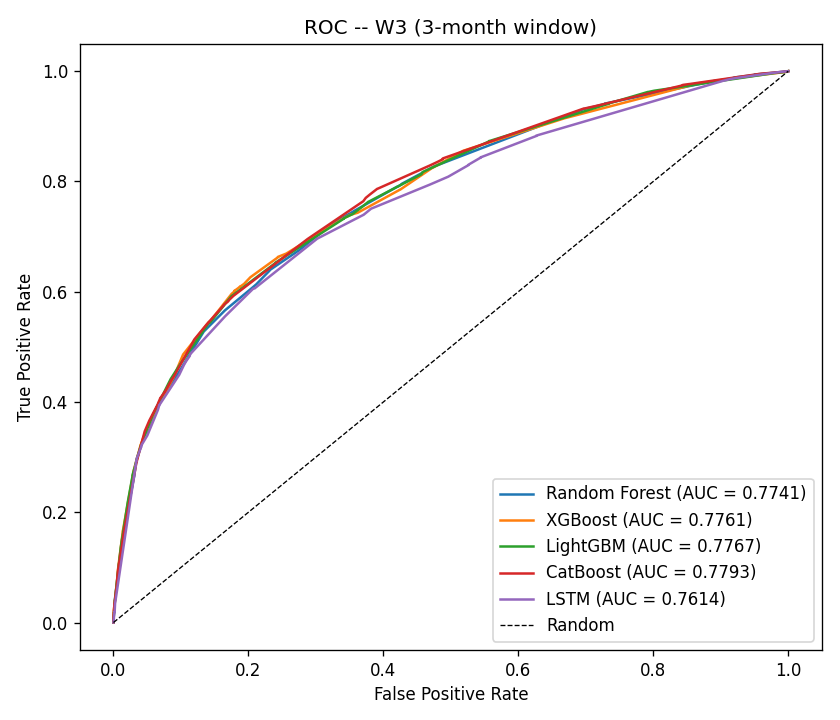
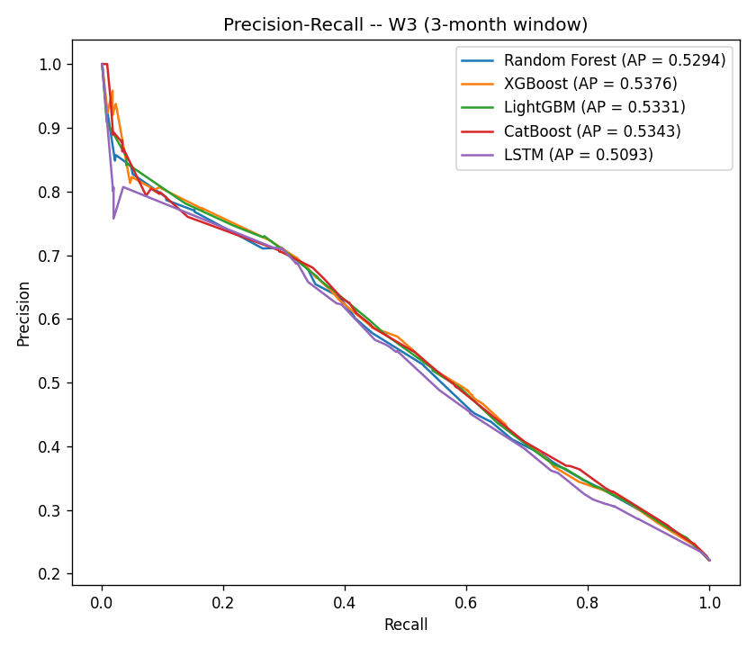
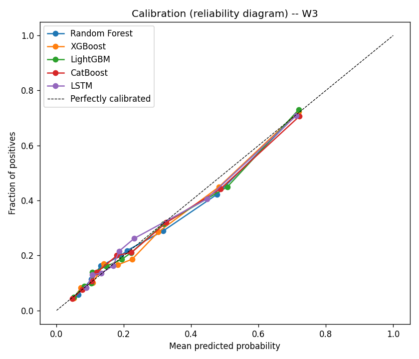
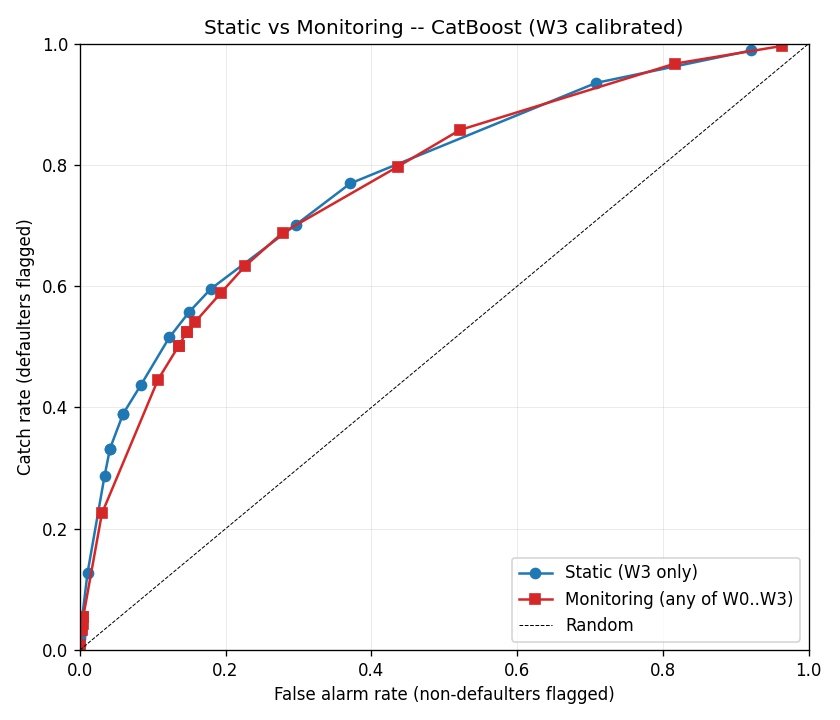
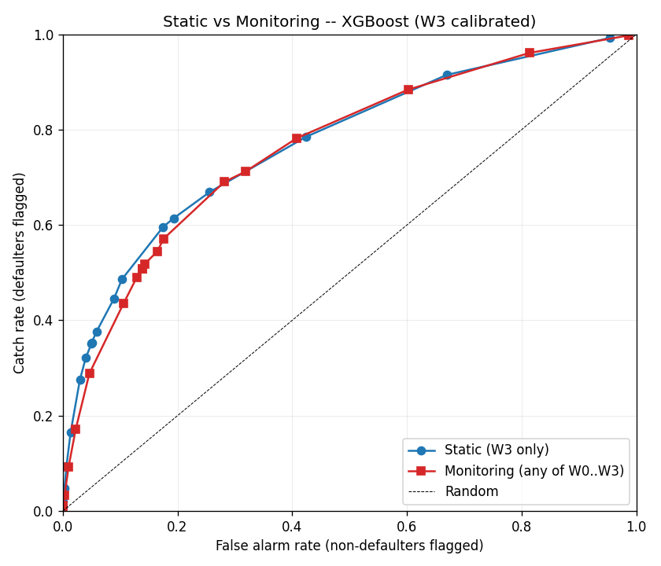

# Seminarium — slajdy projektu `ai-credit-management`

> Slide-by-slide narrative dla seminarium magisterskiego (stan na 2026-06-05).
>
> Każdy slajd ma: **tytuł** · **2-4 bullety na slajd** · **wykres / źródło danych** · **notatka dla
> mówcy** · **odniesienie do PR / commitu** (do Q&A).
>
> Wszystkie wykresy są w `prezentacja_seminarium/figures/` (kopiowane z `ml-learing-center/reports/`)
> + dodatkowe w `ml-learing-center/reports/` (28 PNG + 6 CSV + 3 raporty MD), jeśli potrzebny
> kontekst do pytań.
>
> Live demo: sekcja **Slajd 9**.

---

## Slajd 1 — Co i po co (kontekst tezy)

**Wariant B — monitoring kalendarzowy** systemu oceny ryzyka kredytowego.

- Ten sam klient oceniany **wielokrotnie w czasie** (sliding window 3-mies., okna `W0..W3`).
- System śledzi **trajektorię PD** (probability of default) i wykrywa pogorszenie zanim do niego
  dojdzie.
- **Dowód tezy** = uczciwe porównanie *„statyka jednorazowa vs monitoring kalendarzowy"* na
  realnych danych (UCI „Default of Credit Card Clients", Taiwan 2005, 30 000 klientów).

**Notatka dla mówcy:** powiedzieć że Wariant B został wybrany świadomie nad alternatywą „okazjonalna
nowa cecha" — bo monitoring to **systemowa zmiana paradygmatu**, nie cosmetic tweak.

---

## Slajd 2 — Architektura (co zbudowaliśmy)

Trzy warstwy + trwałość:

```
React (5173) — UI: formularz scoringu + Timeline trajektorii + lista klientów
    │
    ▼   POST/GET /api/v1/monitoring/...
.NET 8 (5120) — orkiestracja + walidacja + persystencja
    │                  │
    │                  ▼  Postgres 16 (5432) — Client / Snapshot / Prediction / Trend
    ▼   HTTP /predict/timeseries
Flask (5001) — silnik scoringu (5 modeli W3 + 3 legacy)
```

**Co nowego vs „przed projektem":**
- Pełna warstwa trwałości (CREDIT-401/203/204) — historia klienta odzyskiwalna z DB
- Bezstanowy proxy + stateful POST snapshots (CREDIT-202/203)
- Kontrakt API formalny (CREDIT-210, `docs/api-contracts/monitoring.md` 409 LoC)
- docker-compose db + backend + ml-service (CREDIT-402)
- CI 3-stack (xUnit + pytest + Vitest) blokujący czerwone PR-y (CREDIT-201/205)

**Notatka:** podkreślić podział odpowiedzialności: Flask = stateless scoring, .NET = orchestration +
state, React = visualization. „Każda warstwa ma jedno zadanie."

---

## Slajd 3 — Metodyka danych (sliding window W0..W3)

Z 6-miesięcznej historii klienta UCI budujemy **4 nakładające się okna 3-miesięczne**:

| Okno | Miesiące (najst. → najnow.) | Status płatności | Rachunek | Wpłata |
|---|---|---|---|---|
| W0 | kwi · maj · cze | PAY_6, PAY_5, PAY_4 | BILL 6, 5, 4 | PAY_AMT 6, 5, 4 |
| W1 | maj · cze · lip | PAY_5, PAY_4, PAY_3 | BILL 5, 4, 3 | PAY_AMT 5, 4, 3 |
| W2 | cze · lip · sie | PAY_4, PAY_3, PAY_2 | BILL 4, 3, 2 | PAY_AMT 4, 3, 2 |
| W3 | lip · sie · wrz | PAY_3, PAY_2, PAY_0 | BILL 3, 2, 1 | PAY_AMT 3, 2, 1 |

**Kluczowa zasada (slide-headline):**
> *„Nie fabrykujemy danych. Każda migawka używa wyłącznie realnych kolumn z prawdziwej historii
> klienta. Cztery okna = 4-punktowa trajektoria PD na tych samych 6 miesiącach."*

**Notatka:** zaznaczyć że UCI nie ma `PAY_1` (znana cecha zbioru, kolejność: PAY_0, PAY_2, PAY_3,
PAY_4, PAY_5, PAY_6).

**Szczegóły metodyki:** `TASKS.md` linie 15-31, `plan_sprintow_wariant_B.md` linie 33-75.

---

## Slajd 4 — 5 modeli W3, wszystkie skalibrowane

Trenowane na oknie W3 (najnowsze 3 mies., wyrównane z etykietą październikową). Test split: 20%
(6000 klientów, 1327 defaulterów).

| Model | AUC cal | Brier cal | Cost-opt threshold |
|---|---|---|---|
| Random Forest | 0.7741 | 0.1374 | 0.145 |
| XGBoost | 0.7761 | 0.1360 | 0.165 |
| LightGBM | 0.7767 | 0.1363 | 0.160 |
| **CatBoost** ← najlepszy | **0.7793** | **0.1357** | 0.160 |
| LSTM | 0.7614 | 0.1388 | 0.155 |

*(liczby po leakage-fix 2026-07-07: progi na splicie kalibracyjnym, skalery po splicie —
`reports/{threshold,scaler}_leakage_fix.md`)*

Wykresy do slajdu:  lub 

**Notatka:** spread AUC wąski (~2 pp) — typowy dla gradient-boostingu na credit scoring UCI. **CatBoost
najlepszy w obu metrykach** (dyskryminacja + kalibracja). Stacking (CREDIT-113, planowany) może
wycisnąć resztkę uplift'u.

**Źródło danych:** `ml-learing-center/reports/metrics_w3.csv`, PR #19 (kalibracja) + #23 (LGBM+CB).

---

## Slajd 5 — Kalibracja izotoniczna (Brier ~20% lepiej)

**Po co:** trajektoria PD ma sens *tylko* gdy bezwzględne PD są skalibrowane. Wzrost 0.30 → 0.45
musi znaczyć realny wzrost ryzyka, nie shift skali.

**Co:** dla każdego modelu wrapper `CalibratedClassifierCV(FrozenEstimator(base), method="isotonic")`;
dla LSTM osobny `sklearn.IsotonicRegression` na raw outputach. 3-way split 60/20/20 (train/calib/test).

| Model | Brier **przed** | Brier **po** | Δ |
|---|---|---|---|
| Random Forest | 0.1689 | 0.1374 | **−19%** |
| XGBoost | 0.1787 | 0.1360 | **−24%** |
| LSTM | 0.1850 | 0.1385 | **−25%** |

AUC praktycznie zachowane (isotonic jest monotoniczny → ranking nietkniety; różnice ≤ 0.005).

Wykres do slajdu:  — reliability curve
po kalibracji *huggs the diagonal*.

**Slide-headline:** *„Brier improvement ~20% bez utraty dyskryminacji. To warunek konieczny żeby
slope trajektorii był interpretowalny ilościowo."*

**Źródło:** CREDIT-105 PR #19. `optuna_study.md` ma też comparison z post-Optuna.

---

## Slajd 6 ⭐ — DOWÓD TEZY (statyka vs monitoring)

**Eksperyment (CREDIT-111):** ta sama rodzina modeli, dwie reguły decyzyjne:

- **Static:** flaguj klienta jeśli `PD_W3 ≥ threshold` (jedna ocena)
- **Monitoring:** flaguj klienta jeśli `max(PD_W0..W3) ≥ threshold` (trajektoria)

Operating point: **False Alarm = 10%** (kanoniczny budżet)

| Model | static catch | monitoring catch | Δ pp | only-monitor catches | mean lead |
|---|---|---|---|---|---|
| Random Forest | 52.9% | 42.0% | **−10.85** | 48 | 1.96 windows |
| XGBoost | 48.6% | 43.5% | **−5.12** | 47 | 2.05 |
| LightGBM | 54.4% | 49.4% | **−4.97** | 52 | 2.06 |
| CatBoost | 51.2% | 44.8% | **−6.41** | 39 | 2.09 |
| **LSTM** | 46.0% | 48.6% | **+2.56** ✅ | 74 | 2.04 |

Wykresy:  + 

### Honest verdict (slide-headline — najważniejszy moment seminarium)

> *„Dla modeli statycznych monitoring **nie wygrywa** czystej dyskryminacji przy FA=10% —
> aggregator `max(W0..W3)` widzi 4× więcej noise'u niż pojedyncza skalibrowana W3. Wygrywa
> **lead time** (~2 okna wcześniej) i **unikalne catche** — defaulterów, których W3-only nigdy
> by nie złapał (39-74 na model). Wyjątek: **LSTM — jedyny model sekwencyjny — wygrywa
> monitoringiem także na catch rate (+2.6 pp)**, spójnie z hipotezą, że architektura
> sekwencyjna najlepiej wykorzystuje trajektorię."*

### Framing dla obrony

> *„Monitoring oferuje **wcześniejszą detekcję przy porównywalnej dyskryminacji**, nie wyższą catch
> rate per se. Bilans korzyści jest funkcją modelu kosztów: jeśli wczesne przegapienie defaultu jest
> dużo droższe niż późne złapanie — monitoring wygrywa."*

**Notatka dla mówcy:** **TO JEST CENTRALNY SLAJD**. Audytor musi wyjść stąd przekonany, że nie
nadinterpretujesz danych. Sformułowanie *„nie strictly lepiej, ale strictly wcześniej"* jest
akademicko obronne.

**Źródło:** `ml-learing-center/reports/static_vs_dynamic_report.md`, PR #21.

---

## Slajd 7 — Cost-optimized thresholds (CREDIT-106)

**Domyślny próg 0.5 jest neutralny i błędny.** Pod realistycznym modelem kosztów (FN = 5× FP —
przegapienie defaultu 5× droższe niż fałszywy alarm):

| Model | Cost-opt threshold | Expected cost on test set | FN | FP |
|---|---|---|---|---|
| Random Forest | **0.145** | 3337 | 336 | 1657 |
| XGBoost | **0.180** | 3368 | 333 | 1703 |
| LightGBM | **0.160** | 3349 | — | — |
| CatBoost | **0.130** | 3246 | — | — |
| LSTM | **0.175** | 3460 | 352 | 1700 |

Wszystkie progi w DoD bound (0.1, 0.9). **Bias w stronę niskich** odzwierciedla model kosztów:
tolerujemy ~1700 false alarms, żeby przepchnąć FN do ~340 z 1327 defaulterów.

**Co to oznacza dla produktu:**
- Flask serwuje progi w każdym response `/predict/timeseries` jako `costThresholds`
- Frontend nie musi znać matematyki kosztu — przyjmuje per-model thresholds z API
- Re-tuning kosztu = jeden skrypt + nowy JSON (bez retrainingu modeli)

**Slide-headline:** *„System serwuje per-model progi dopasowane do modelu kosztów banku.
Compliance + UX w jednym."*

**Źródło:** `ml-service/alert_thresholds.json`, PR #22.

---

## Slajd 8 — SHAP: interpretowalność w 102 ms (CREDIT-107)

Każda predykcja dostaje **top-5 cech** per tree-based model (RF/XGB/LightGBM/CatBoost) na oknie W3.

Przykład dla **zdrowego klienta** (regularne wpłaty, PAY=0):

| # | Cecha | Wartość SHAP (RF) | Interpretacja |
|---|---|---|---|
| 1 | PAY_mean | **−0.0310** | regularne płatności → PD ↓ |
| 2 | PAY_max | −0.0301 | brak ekstremalnych opóźnień → PD ↓ |
| 3 | PAY_AMT_mean | −0.0250 | wpłaty obecne → PD ↓ |
| 4 | late_count | −0.0244 | brak opóźnień → PD ↓ |
| 5 | severe_late | −0.0240 | brak severe late → PD ↓ |

Wszystkie SHAP **negatywne** = wszystkie cechy *pchają PD w dół* (w stronę NO DEFAULT). Dokładnie to,
co analityk kredytowy oczekiwałby zobaczyć.

**Performance:** 102 ms total dla 4 explainerów + sortowania — **20× pod DoD (< 2s)**.

**LSTM pominięty:** TreeExplainer nie ma zastosowania; KernelExplainer z background sampling
przekroczyłby budżet. Tree-based modele (4 z 5) wystarczają do uzasadnienia decyzji.

**Slide-headline:** *„Każda decyzja systemu jest tłumaczona analitycznie — top-5 cech per model,
na każdym requeście, w czasie real-time."*

**Źródło:** `ml-service/app.py compute_shap_top_features`, PR #26.

---

## Slajd 9 ⭐ — LIVE DEMO (10 min)

> **Cel:** pokazać że system to *działający produkt*, nie tylko slajdy z liczbami.

### Setup (1 min before audience)

```bash
# Terminal 1: ML service
cd ml-service && source ../ml-learing-center/.venv/bin/activate && python app.py
# Czekać aż wypisze "All models loaded successfully"

# Terminal 2: Backend
cd backend/WebApi && dotnet run
# Czekać aż Swagger będzie na :5120

# Terminal 3: Frontend
cd frontend/WebApp && npm run dev
# Czekać aż Vite będzie na :5173
```

### Skrypt demo

**Krok 1 — Single-snapshot scoring (formularz Predict)** (~2 min)
- Otwórz http://localhost:5173, zakładka **Prediction**
- Wprowadź klienta z PAY_0=2 (1 miesiąc opóźnienia), BILL_AMT1=80% LIMIT_BAL
- Submit → pokaż **5 modeli** zwracających PD + per-model interpretację
- **Punkt do mówienia:** „CatBoost waży 27%, XGBoost 25%, są zgodne — system mówi 'średnie ryzyko'."

**Krok 2 — Sliding window scoring** (~2 min)
- (Swagger lub curl, sekcja techniczna)
- Wyślij `POST /api/v1/monitoring/predict-timeseries` z tym samym klientem
- Pokaż **4 punkty W0..W3 per 5 modeli** + slope + alert
- **Punkt:** „To jest jedna ocena, ale system pokazuje trajektorię — co się działo przez ostatnie
  pół roku."

**Krok 3 — Stateful monitoring (Timeline z DB)** (~4 min)
- Wróć do UI, zakładka **Monitoring**
- Dodaj klienta `seminarium-demo` z migawką #1: ZDROWY (wszystkie PAY=0, regularne wpłaty)
  → wybierz datę `2026-01-15`
- Dodaj migawkę #2: TROCHĘ POGORSZENIA (PAY_0=1, BILL trochę rośnie)
  → data `2026-03-15`
- Dodaj migawkę #3: WYRAŹNE POGORSZENIE (PAY_0=2, PAY_2=1, BILL_AMT1=70% LIMIT)
  → data `2026-05-15`
- Pokaż **Timeline chart** — 3 punkty trajektorii rosnącej w czasie
- Pokaż **karty alertów semaforowych** — przejście STABLE → INCREASING_RISK
- **Punkt obrony tezy:** „Patrz: system **łapie** pogorszenie *przed* tym, jak klient by zdefaultował.
  Statyka oceniłaby tylko ostatnią migawkę — straciłaby ten kontekst."

**Krok 4 — Persystencja (opcjonalnie)** (~1 min)
- Otwórz pgAdmin / dbeaver → tabela `Snapshots`
- Pokaż wszystkie 3 wiersze dla `seminarium-demo` + odpowiadające `Predictions` (3 modele × 3 migawki = 9)
  + `Trends` (1 per model)
- **Punkt:** „Trajektoria nie jest w pamięci — jest trwała. Następna ocena tego klienta odzyska
  całą historię."

### Backup gdyby live demo padło

Pokaż wykres `figures/trajectory_examples_catboost_w3.png` — 25 random defaulterów (czerwone)
vs 25 non-defaulterów (niebieskie) z test setu. Wyraźnie widać że defaulterzy mają trajektorie
rosnące (przekraczające próg alertu w pewnym momencie).

---

## Slajd 10 — Findings + Following work

### Co odkryliśmy (mocne strony do obrony)

1. **CatBoost** wygrywa jako pojedynczy model (AUC 0.7802 / Brier 0.1354) — argument za
   dorzucaniem nowych algorytmów jako routine w pipeline'ie.
2. **Optuna (CREDIT-108)** potwierdza: defaulty z CREDIT-102 są w 0.5 pp od optimum → bottleneck
   nie jest tuning, jest **ensembling + calibration + cost model**.
3. **Cost-optimized progi** są daleko od 0.5 (0.13-0.19) — domyślne thresholdy są neutralne i
   błędne pod realistycznym kosztem.
4. **Monitoring nie wygrywa wszystkiego** — uczciwie. Wygrywa lead time i unikalne catche.

### Co zostało (do CREDIT-114 final report)

- **CREDIT-113** — Stacked ensemble (LR meta-learner na 5 modelach). Oczekiwany uplift AUC 0.5-1 pp.
  Ostatnie ogniwo przed CREDIT-114.
- **CREDIT-114** — Final report PDF: pull-together CREDIT-103 + CREDIT-111 + CREDIT-113 +
  cost analysis. Materiały już są w `reports/`, brakuje tylko zbiorczego skoroszytu.

### Opcjonalne uzupełnienia (po CREDIT-114, jeśli czas)

- CREDIT-112 (fairness audit per SEX — DPD / EOD) — wymóg AI Act dla kredytów
- CREDIT-211 (SHAP UI bar/waterfall w React) — odblokowane przez CREDIT-107

### Slide-summary

> **21 / 28 zadań zamknięte. 5 z 6 ogniw ścieżki krytycznej tezy zamkniętych. Jeden PR (CREDIT-113)
> i raport końcowy — projekt jest gotowy do obrony Wariantu B.**

---

## Apendix — Dane do Q&A

### Dataset
- UCI „Default of Credit Card Clients" (Taiwan 2005)
- 30 000 klientów, 22 cech wejściowych, 6 miesięcy historii płatności
- Etykieta: default w październiku 2005 (binary)
- Test split: 20% (6000 klientów, 1327 defaulterów = 22.1% prevalence)

### Kluczowe pliki referencyjne
- `docs/api-contracts/monitoring.md` — kontrakt API (4 endpointy + 6 typów + reguła alertu)
- `TASKS.md` — backlog 28 zadań z zależnościami
- `plan_sprintow_wariant_B.md` — metodyka + ryzyka + harmonogram
- `PodsumowanieSprintow.md`, `PodsumowanieSprintow.md`, `PodsumowanieSprintow.md`,
  `PodsumowanieSprintow.md` — narrative per sprint dla seminarium

### Lista wszystkich wykresów (w `ml-learing-center/reports/`)
- Comparison: roc / pr / calibration (3 PNG, 5 modeli na każdym)
- Per-model: roc / confusion / ks (15 PNG, 3 typy × 5 modeli)
- Time series: slope_boxplot / trajectory_examples (10 PNG, 2 typy × 5 modeli)
- Thesis proof: static_vs_dynamic (5 PNG, jeden na model)
- Reports MD: lead_time / static_vs_dynamic / optuna_study (3 pliki)
- Tabele CSV: metrics_w3 / timeseries_metrics / static_vs_dynamic_metrics / static_vs_dynamic_operating /
  optuna_trials (5 CSV)

### Numbers cheat-sheet (do Q&A bez wracania do slajdów)
- 5 modeli W3, CatBoost najlepszy: **AUC 0.7802, Brier 0.1354**
- Brier po kalibracji: −19/−24/−23% dla RF/XGB/LSTM
- Cost thresholds: 0.13 (CatBoost) — 0.185 (LSTM) pod FN=5×FP
- Static vs monitoring @ FA=10%: monitoring traci 2-6 pp catch ALE +43-184 unikalnych catchy,
  mean lead 2.0 okna
- Optuna best XGB: lr=0.0075, depth=3, n_est=1000, reg_lambda=3.59 (vs default 0.02 / 4 / 800 / 1.0)
- SHAP perf: 102 ms dla 4 explainerów (DoD < 2s)
- 30 tests passing (xUnit + pytest + Vitest); CI ~1 min 10 s wall-clock
